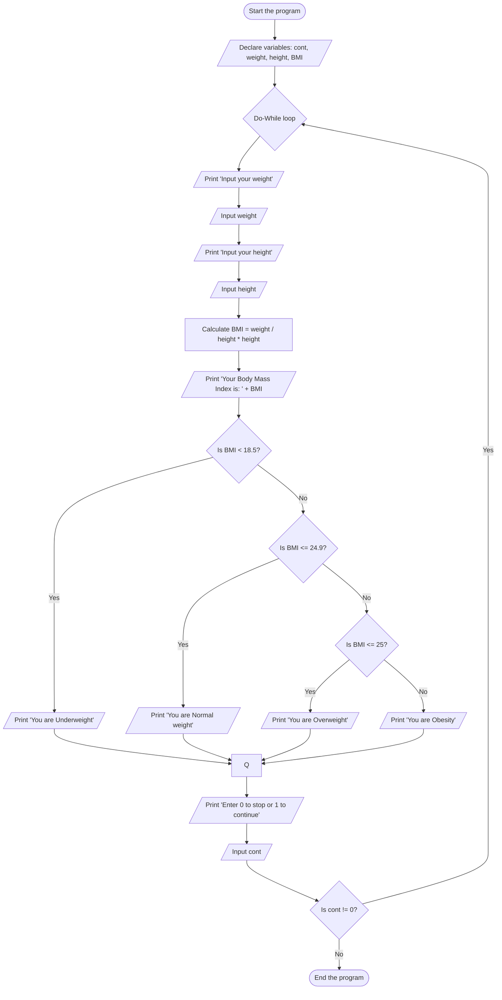

# System design for BMI Calculator

## ** Input **

User's weight
User's height
Continue option (0 to stop, 1 to continue)

## ** Output **

Body Mass Index (BMI)
Weight status based on BMI (Underweight, Normal weight, Overweight)

## Process

Declare variables weight, height, BMI, and cont.
Use a loop to continuously ask the user to input their weight and height.
Calculate the BMI using the formula: BMI = weight / (height * height).

**Print the calculated BMI.**

Determine and print the weight status based on the BMI:
If BMI < 18.5, print "You are Underweight."
If 18.5 <= BMI <= 24.9, print "You are Normal weight."
If BMI > 24.9, print "You are Overweight."
Ask the user if they want to continue or stop. If the user inputs 0, stop the loop.
Pseudo Code
1. Start the program.

2. Declare cont as an integer and weight, height, BMI as float data types.

3. Do the following steps:

    3.1 Prompt the user to input their weight.

   3.2 Take the input for weight and store it in the weight variable.

    3.3 Prompt the user to input their height.

    3.4 Take the input for height and store it in the height variable.

   3.5 Calculate the BMI as weight / (height * height) and store the result in the BMI variable.

   3.6 Print the BMI result as Your Body Mass Index is: BMI.

    3.7 Check the BMI category:

   7.1 If BMI < 18.5, print You are Underweight.

    7.2 Else if 18.5 <= BMI <= 24.9, print You are Normal weight.

     7.3 Else if BMI > 25, print You are Overweight.

   8.Prompt the user to enter 0 to stop or 1 to continue.

   9.Take the input for cont and store it in the cont variable.

4.Repeat the loop while cont != 0.

5.Stop the program.# flowchart

