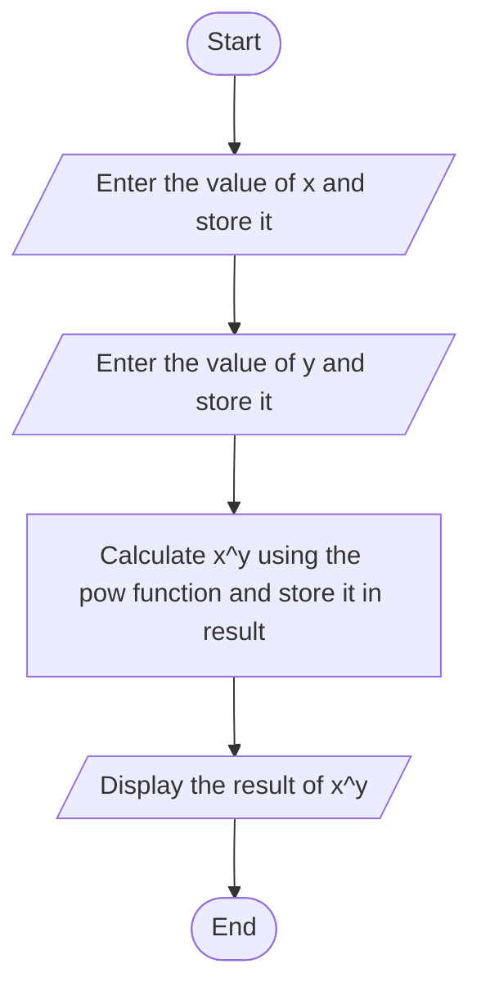

## Input
1. x: The base value (double).
2. y: The exponent value (double).

---

## Process
1. Prompt the user to enter the base value (x).
2. Prompt the user to enter the exponent value (y).
3. Calculate the power using the formula:
   \[
   \text{result} = \text{pow}(x, y)
   \]
   where pow is a mathematical function to compute \( x^y \).
4. Display the result of \( x^y \).

---

## Output
- The calculated value of \( x^y \).

## Pseudocode

1. Start
2. Declare variables:
   - x as double (base).
   - y as double (exponent).
   - result as double (to store the calculated power).
3. Print "Enter the value of x:"
4. Input x
5. Print "Enter the value of y:"
6. Input y
7. Calculate result using the power function:
   \[
   \text{result} = \text{pow}(x, y)
   \]
8. Print "Result of ", x, "^", y, " is: ", result
9. End

## flowchart

