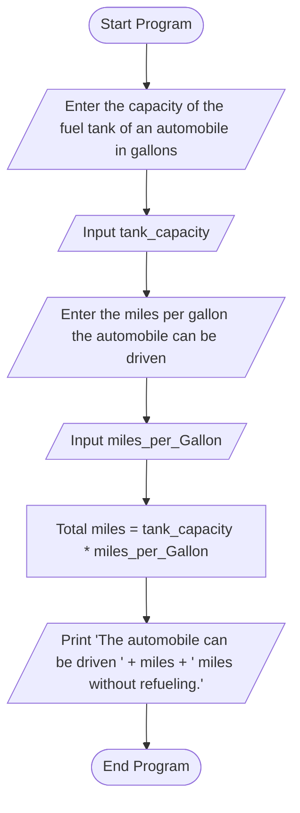

```mermaid
graph TD
    A([Start Program]) --> B[/"Enter the capacity of the fuel tank of an automobile in gallons"/]
    B --> C[/Input tank_capacity/]
    C --> D[/"Enter the miles per gallon the automobile can be driven"/]
    D --> E[/Input miles_per_Gallon/]
    E --> F["Total miles = tank_capacity * miles_per_Gallon"]
    F --> G[/Print 'The automobile can be driven ' + miles + ' miles without refueling.'/]
    G --> H([End Program])
```
