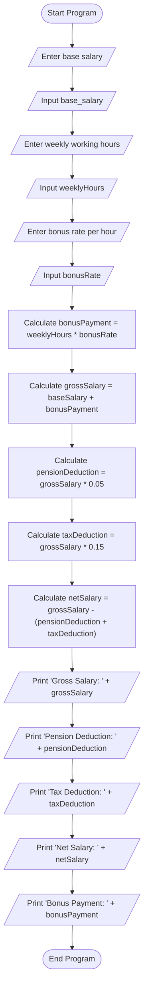

# flow chart

```mermaid
graph TD
    A([Start Program]) --> B[/"Enter base salary"/]
    B --> C[/Input base_salary/]
    C --> D[/"Enter weekly working hours"/]
    D --> E[/Input weeklyHours/]
    E --> F[/"Enter bonus rate per hour"/]
    F --> G[/Input bonusRate/]
    G --> H["Calculate bonusPayment = weeklyHours * bonusRate"]
    H --> I["Calculate grossSalary = baseSalary + bonusPayment"]
    I --> J["Calculate pensionDeduction = grossSalary * 0.05"]
    J --> K["Calculate taxDeduction = grossSalary * 0.15"]
    K --> L["Calculate netSalary = grossSalary - (pensionDeduction + taxDeduction)"]
    L --> M[/"Print 'Gross Salary: ' + grossSalary"/]
    M --> N[/"Print 'Pension Deduction: ' + pensionDeduction"/]
    N --> O[/"Print 'Tax Deduction: ' + taxDeduction"/]
    O --> P[/"Print 'Net Salary: ' + netSalary"/]
    P --> Q[/"Print 'Bonus Payment: ' + bonusPayment"/]
    Q --> R([End Program])
```
