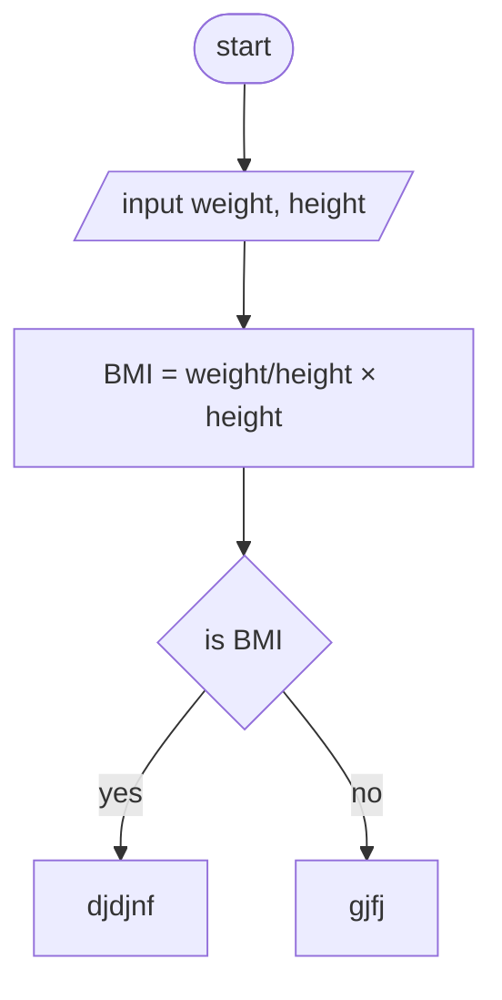

## Input
Number of people (num_reptition)
Weight of each person in kg (weight)
Height of each person in meters (height)
## Output
Body Mass Index (BMI) for each person
Weight category (Underweight, Normal weight, Overweight) for each person
**Process**
Input the number of people.
For each person:
Input weight.
Input height.
Validate the inputs.
Calculate BMI using the formula 
BMI=weight/height*height.
Determine the weight category based on the BMI.
Output the BMI and weight category.
## Pseudocode
START
    Input: num_reptition
    IF num_reptition <= 0
        Output: "invalid input. Please enter a positive number!"
        RETURN

    FOR i = 1 TO num_reptition
        Input: weight
        IF weight <= 0
            Output: "invalid input. Please enter a positive number!"
            RETURN

        Input: height
        IF height <= 0
            Output: "invalid input. Please enter a positive number!"
            RETURN

        Calculate BMI = weight / (height * height)
        Output: "your body mass index is: ", BMI

        IF BMI < 18.5
            Output: "under weight"
        ELSE IF BMI > 25
            Output: "over weight"
        ELSE
            Output: "normal weight"
END
START
  |
  v
Input: weight, height
  |
  v
Calculate BMI = weight / (height * height)
  |
  v
Is BMI < 18.5?
  | YES         | NO
  v             v
Output:        Is BMI < 24.9?
"Underweight"   | YES         | NO
                v             v
            Output:       Output:
            "Normal       "Overweight"
            weight"
  |
  v
Calculate for another person? (yes/no)
  | YES                | NO
  v                    v
(REPEAT)             END

