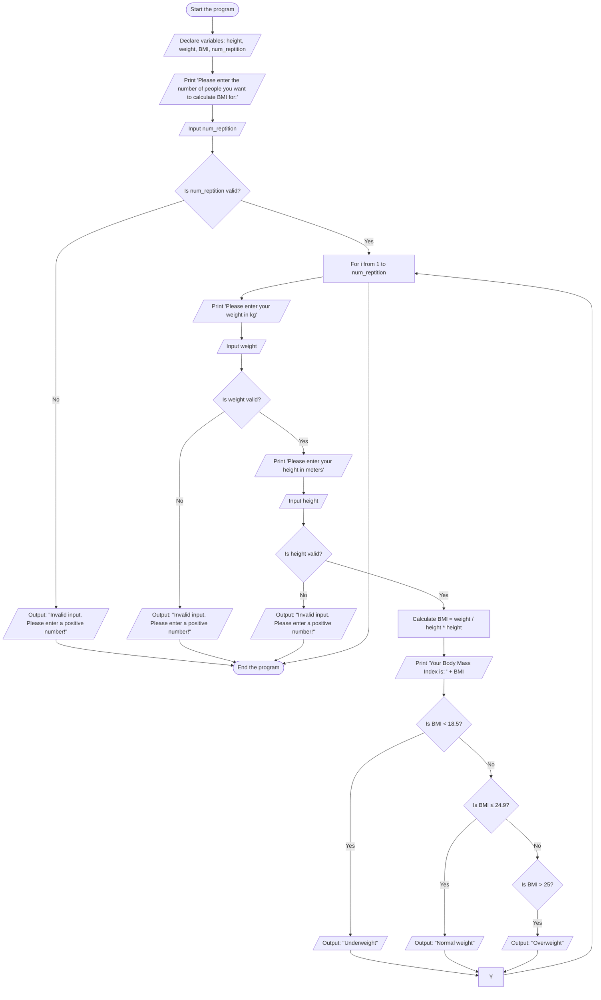

# System Design for BMI Calculator
## Input
**Weight (weight):** Double data type, representing the user's weight in kilograms.

**Height (height):** Double data type, representing the user's height in meters.

**Number of repetitions 
(num_reptition):** Integer data type, representing the number of people to calculate BMI for.

## Output
**BMI:** Double data type, representing the calculated Body Mass Index.

**Weight Category:** A message indicating the BMI category:

"Underweight" if BMI < 18.5

"Normal weight" if 18.5 ≤ BMI ≤ 24.9

"Overweight" if BMI > 24.9
## Operation
**BMI Calculation:** Use the formula 

BMI = weight / (height * height) to calculate the Body Mass Index.
## Pseudo Code
**Start the program.**

**Declare variables:**
weight (weight), height (height), BMI (Body Mass Index) as double, and num_reptition as int.

**prompt the user to input the number of people to calculate BMI for.** 

Input the value of num_reptition.

If num_reptition <= 0, then
    Output: "Invalid input. Please enter a positive number!"
	
 Stop the program.
 
**For i from 1 to num_reptition, do the following:**

 **Prompt the user to input their weight.**

**Input the value of weight.**
 
If weight <= 0, 
then
Output: "Invalid input. Please enter a positive number!"

Stop the program.    
 **Prompt the user to input their height.**
    
**Input the value of height.**
   If height <= 0, then
   
**Output:** "Invalid input. Please enter a positive number!"

  Stop the program.    
   **Calculate BMI using BMI = weight / (height * height).**
    
**Output the calculated BMI**

  Check the BMI category:
	
If BMI < 18.5, then
            Output: "Underweight"
			
 Else if 18.5 ≤ BMI ≤ 24.9, then
            Output: "Normal weight"
			
 Else
            Output: "Overweight"
			
**Stop the program.**

# FlowChart

