START
  |
  v
Input: weight, height
  |
  v
Calculate BMI = weight / (height * height)
  |
  v
Is BMI < 18.5?
  | YES         | NO
  v             v
Output:        Is BMI < 24.9?
"Underweight"   | YES         | NO
                v             v
            Output:       Output:
            "Normal       "Overweight"
            weight"
  |
  v
Calculate for another person? (yes/no)
  | YES                | NO
  v                    v
(REPEAT)             END

```mermaid
flowchart TD
A([start]) --> B[/input weight, height/]
B --> C["BMI = weight/height × height"]
C --> D{is BMI}
D -- yes --> E[djdjnf]
D -- no --> F[gjfj]
```

