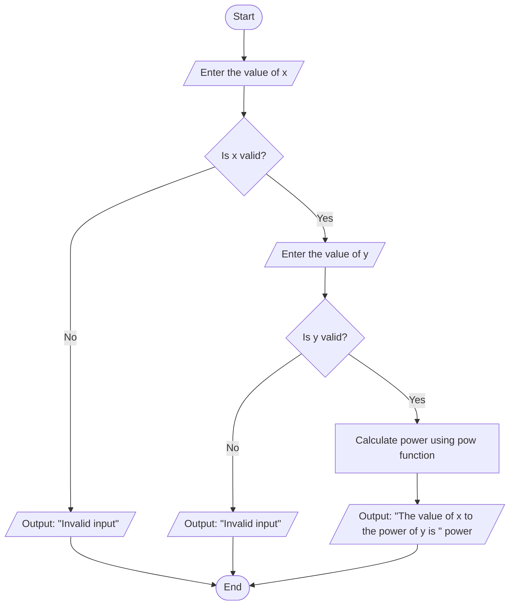

# System Design for Calculating X to the Power of Y
## Input

**Base value (x):** Integer data type, representing the base number.

**Exponent value (y):** Integer data type, representing the exponent.

## Output

**Power (power):** Integer data type, representing the result of 
𝑥 raised to the power of 𝑦.

## Operation

**Power Calculation:** Use the pow function to calculate 
𝑥^ 𝑦.

## Pseudo Code

**Start the program.**

**Declare variables:** x, y, and power as int.

**Prompt the user to input the value of x.**
**Input** the value of x.

If the input for x is invalid, then

   Output: "Invalid input"
    Stop the program.

**Prompt the user to input the value of y.**

Input the value of y.

If the input for y is invalid, then
    Output: "Invalid input"
    
   Stop the program.

**Calculate power using power = pow(x, y).**
**Output** the value of x raised to the power of y.

**Stop the program.**
# FlowChart

