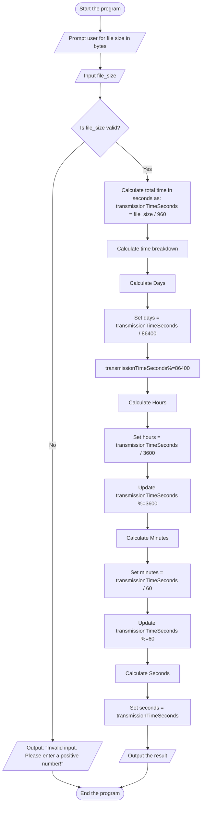

# System Design for File Transmission Time Calculation
## Input

**File Size (fileSize):** Double data type, representing the size of the file in bytes.

## Output

**Transmission Time:** The time taken to transmit the file, displayed in days, hours, minutes, and seconds.

## Operation

**Transmission Time Calculation: Use the formula** 
transmissionTimeSeconds = fileSize / characterPerSecond to calculate the total transmission time in seconds.

Convert this time into days, hours, minutes, and seconds.

## Pseudo Code

**Start the program.**

**Declare constants:** characterPerSecond = 960.

**Declare variables:** fileSize as double, transmissionTimeSeconds as double, days, hours, minutes, seconds as int.

**Prompt the user to input the file size in bytes.**
Input the value of fileSize.

If the input for fileSize is invalid (not a positive number), then

   Output: "Invalid input. Please enter a positive number!"
   
   Stop the program.

**Calculate transmissionTimeSeconds using**
transmissionTimeSeconds = fileSize / characterPerSecond.

**Calculate days using**
days = transmissionTimeSeconds / (24 * 3600).

Update transmissionTimeSeconds using transmissionTimeSeconds = fmod(transmissionTimeSeconds, 24 * 3600).

**Calculate hours using** 
hours = transmissionTimeSeconds / 3600.

Update transmissionTimeSeconds using transmissionTimeSeconds = fmod(transmissionTimeSeconds, 3600).

**Calculate minutes using** 
minutes = transmissionTimeSeconds / 60.

Update transmissionTimeSeconds using transmissionTimeSeconds = fmod(transmissionTimeSeconds, 60).

**Calculate seconds using**
seconds = transmissionTimeSeconds.

**Output**
the time taken to transmit the file in days, hours, minutes, and seconds.

**Stop the program.**

# FlowChart

